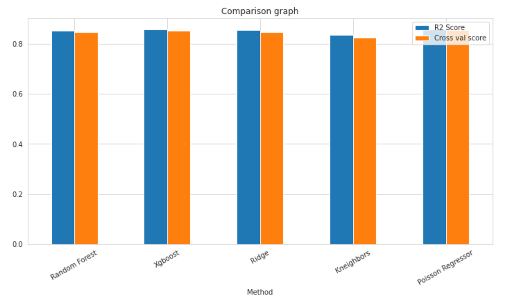
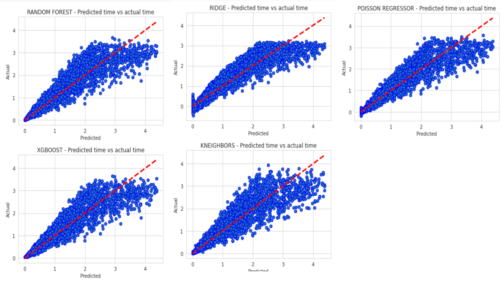

# Empirical-Hardness-Models-Project

**Empirical Hardness Models**
The aim of this research method is to identify some factors of a NPH problem that will determine how difficult some instances of that problem will be for a particular algorithm to solve in practice.

**Case study on the Traveling Salesperson Problem**
The traveling salesperson problem (abbreviated: TSP) asks the following question: "Given a list of cities and the distances between each pair of cities, what is the shortest possible route that visits each city exactly once and returns to the origin city?" It is an NP-hard problem in combinatorial optimization.
In this project we case studied the classic variation and modelled it as a weighted graph (we represented it using an adjacency matrix), such that cities are the graph's vertices, paths are the graph's edges, and a path's distance is the edge's weight. It is a minimization problem starting and finishing at a specified vertex after having visited each other vertex exactly once.

**The methodology of  building Empirical Hardness Models**
The following methodology for predicting the running time of a given algorithm on individual instances of a problem such as TSP, where instances are drawn from some arbitrary distribution was first introduced by Leyton-Brown et al. 2002
* Select an algo of interest - There were many algorithms we could have chosen, Held-Karp or specific implementations of the branch and bound for example, but as the methodology above indicates, there is no to know the internal workings of the algorithm, so we decided to take a black box algorithm from google OR-Tools.
* Select an instance distribution - We selected uniform instance distribution to conduct our study. We first select uniformly the number of cities |𝑉| for the problem instance, in a range of 10 to 350. Then we continue and select the weights for each of our |𝑉^2 | edges for the problem instance, in a range of 1 to 1000. 
* Identify a set of features - We had many features that we thought might be relevant to the empirical hardness of TSP.  Starting with very basic ones such as number of cities we have, or the average weight of the distance matrix, and during this process we also came up with more complex ones. We then examined our data and inferred how our models react to these features.
* Collect data - We generated a data set of 10,000 instances. Where in each instance, as we discussed before, the number of cities is ranging from 10 to 350, and the weight of each edge is ranging from 1 to 1000. All selected uniformly. This data set was then partitioned to a train set and a test set, 70 percent and 30 percent respectively. It is also worth mentioning that we have incorporated an outlier detection mechanism that helped us achieve a bit better results, after we cleaned the outliers from the data set.
* Learn a model - While conducting our study, we tried 5 different regression models 
Random forest, Ridge, XGBoost, K-Neighbors, Linear Regression

**Results**
By completing the steps that mentioned above and experimenting a lot of different features we have reached a situation where all models predict the expected run time of TSP instances with an accuracy of about 85 precent.

It can be seen the accuracy percentages of all the models for predicting run time are almost identical and stand at about 85 percent.

**Discussion**
When we started to work we divided the data we generated into 9 sets we had 3 categories for number of cities range: 10-40, 40-80, 80-160, and 3 categories for weight range: 1-10, 1-100, 1-1000. We started with some very basic features, very quickly we understood that we need to find more significant features because the ones we had did not deliver. We noticed that as we increase the weight range, and by doing so adding a degree of difficulty to our problem instances, our accuracy decreased. The next step for us was getting back to the “drawing board” and try to come up with better features. We went and did a lot of reading on the traveling salesperson problem and looked for other mathematical. Then we started an iterative process of adding new features, testing their effect on the accuracy, and finally filtering those that seemed to have no added value for us. One connection that we found, and that was very helpful during this process, was the connection between the minimum spanning tree (MST) of a graph and the TSP.  Recall that this connection helps us because the computation time of the MST problem is polynomial.

**Code**
You can run the code files in the following order:
* DataGenerator - A notebook that create about 10000 random instances of TSP problem along with all their features and runtimes and saves them into SCV file.
* CleanData - A short notebook that cleans all the abnormal instances from the CSV file so that they do not interfere the models from predicting run time correctly.
* MachineLearningModels - A notebook that extract the data from the clean CSV file into a train and test data (70-30) and run five models to predict run time, all models are tested and given scores by R2score and cross validation score method in order to check their correctness. In addition, in this notebook we examine which features influenced the model's decision-making and we print graphs to show the results.   

